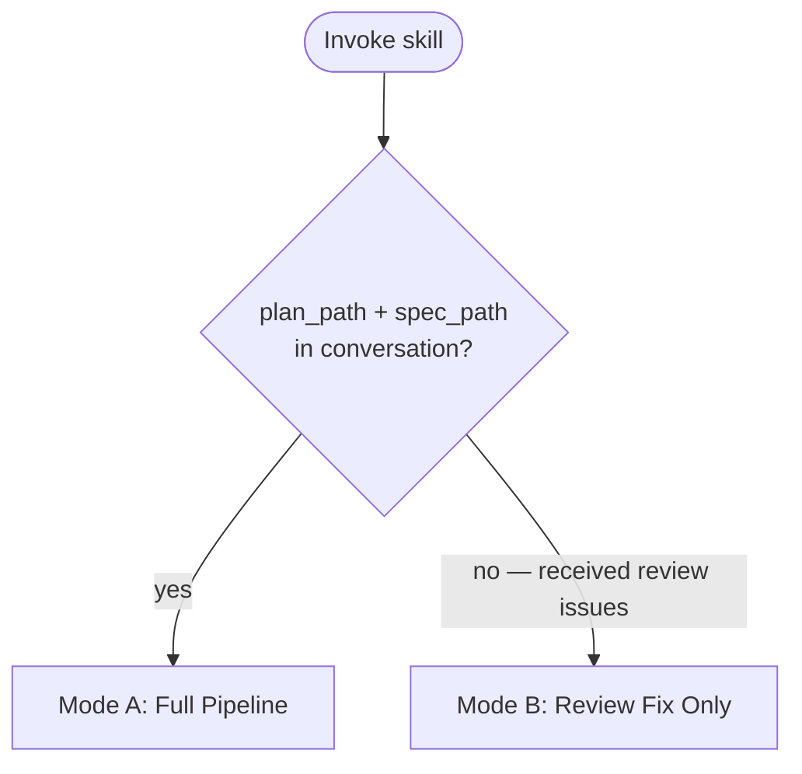
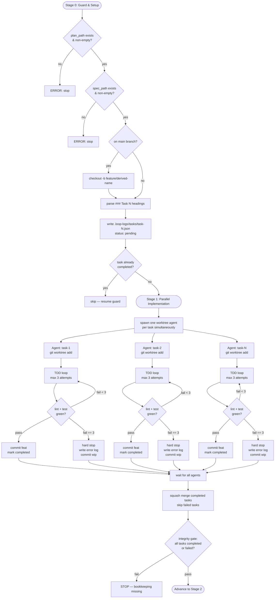
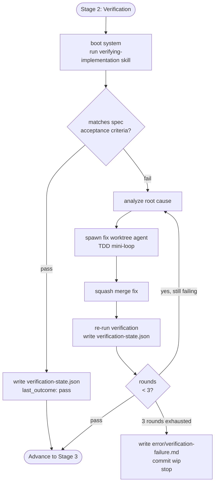
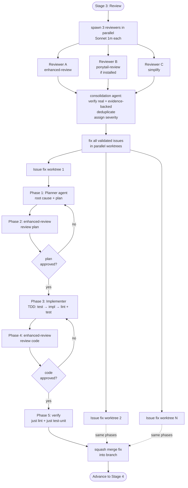
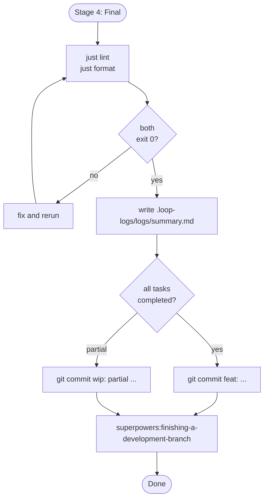
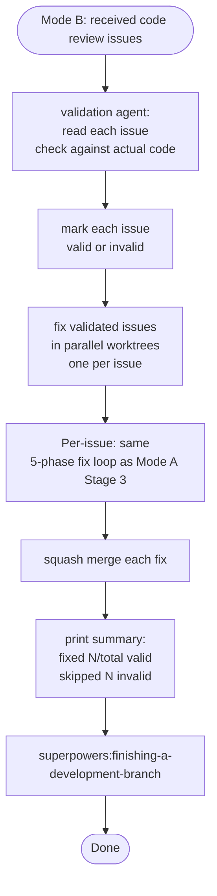

# Agent Workflow

## Mode Selection

---

## Mode A: Full Pipeline

### Stage 0 + 1: Guard, Setup & Parallel Implementation

### Stage 2: Verification

### Stage 3: Review + Fix

### Stage 4: Final Commit

---

## Mode B: Standalone Review Fix

---

## File Ownership

| File                                       | Written by   | When                                                                     |
| ------------------------------------------ | ------------ | ------------------------------------------------------------------------ |
| `.loop-logs/tasks/<task-id>.json`          | Orchestrator | Before spawn (`in_progress`), after agent returns (`completed`/`failed`) |
| `.loop-logs/logs/<task-id>.md`             | Task agent   | Incrementally after each TDD attempt                                     |
| `.loop-logs/error/<task-id>.md`            | Task agent   | On hard stop (3 failures)                                                |
| `.loop-logs/tasks/verification-state.json` | Orchestrator | After each verification round (Stage 2)                                  |
| `.loop-logs/error/verification-failure.md` | Orchestrator | If verification fails after 3 rounds                                     |
| `.loop-logs/logs/summary.md`               | Orchestrator | Stage 4 only                                                             |
