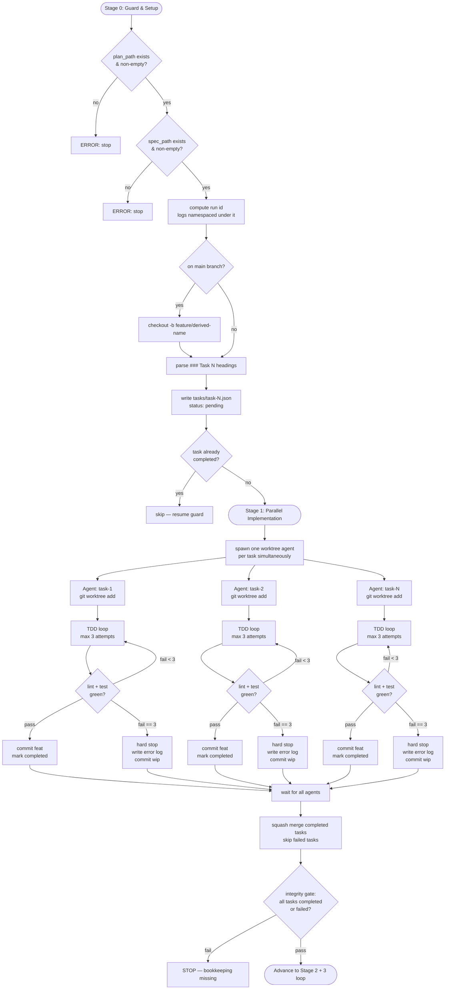
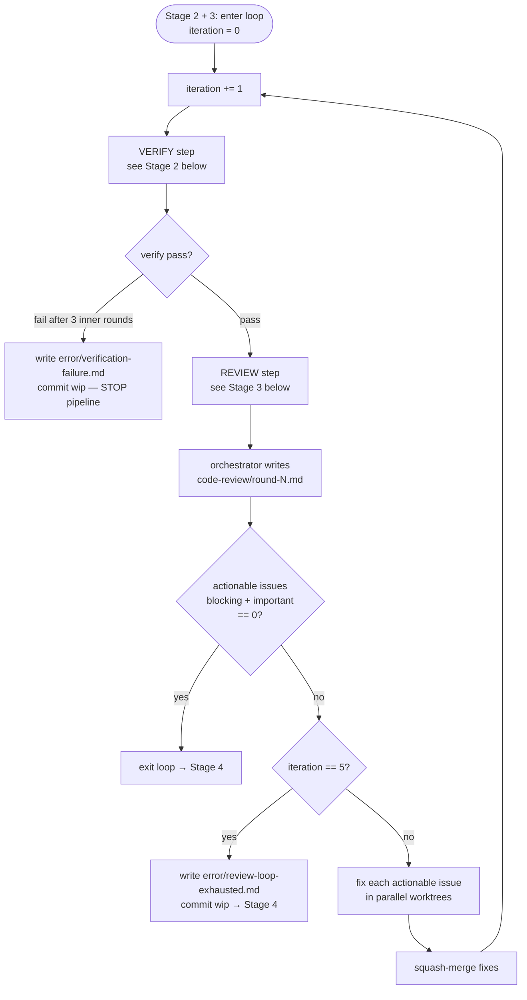
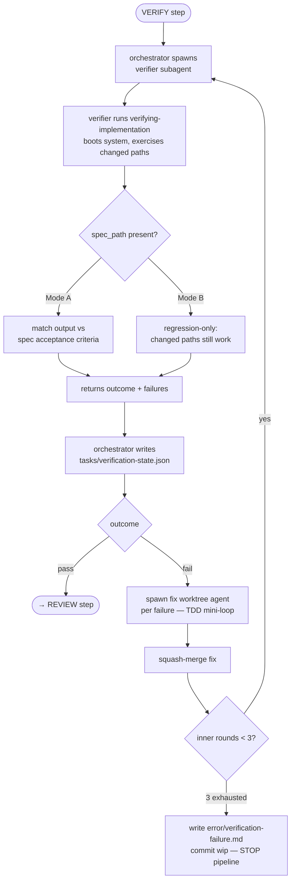
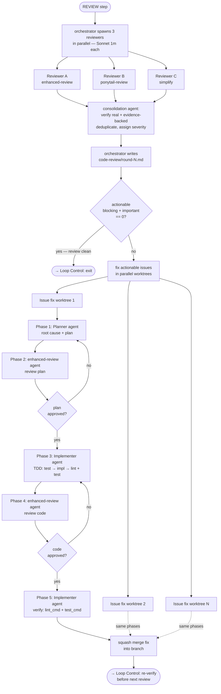
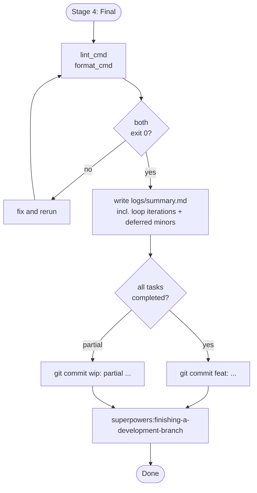
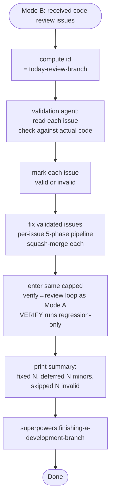

# Agent Workflow

## Mode Selection

**Run `id`.** Stage 0 computes one `id` that namespaces every artifact for the run.
Every log path below is `.loop-logs/<id>/...`.

- Mode A: `id` = plan filename basename, `.md` stripped (`2026-06-16-ticket-3.md` → `2026-06-16-ticket-3`).
- Mode B: `id` = `<today>-review-<current-branch>`.

**Orchestrator purity.** The main agent is a pure orchestrator: it never reads, writes,
or executes product code, quality checks (lint/test/verify), or reviews. Every such
action is delegated to a single-responsibility subagent, and the agent that implements a
fix is never the agent that reviews it. The orchestrator only spawns subagents, reads
their structured output, does git plumbing (squash-merge, worktree/branch lifecycle,
commits), and writes the run's log/state files.

---

## Mode A: Full Pipeline

### Stage 0 + 1: Guard, Setup & Parallel Implementation

### Stage 2 + 3: Capped Verify↔Review Loop

Stages 2 and 3 are a single loop, not two separate passes. Each iteration runs VERIFY
(Stage 2), then REVIEW (Stage 3), then fixes the actionable issues and re-verifies. The
loop exits when a review raises **zero actionable issues**, or after a hard cap of **5
iterations**. `actionable = blocking + important`; minor issues never re-trigger the
loop and are deferred to the final summary.

#### Stage 2: VERIFY step (verifier subagent)

The orchestrator does NOT boot or verify the system itself. It spawns a verifier
subagent and routes on its structured output `{ outcome, failures }`.

#### Stage 3: REVIEW step + actionable fix

Minor issues are recorded in `code-review/round-<N>.md` and surfaced in the final
summary as deferred ("not handled yet"); they are never fixed in-loop.

### Stage 4: Final Commit

---

## Mode B: Standalone Review Fix

Mode B validates and fixes a received code review, then enters the **same capped
verify↔review loop** as Mode A. It has no `spec_path`, so the inherited VERIFY step runs
in regression-only mode.

---

## File Ownership

All paths are namespaced under the run `id`.

| File                                            | Written by   | When                                                                     |
| ----------------------------------------------- | ------------ | ------------------------------------------------------------------------ |
| `.loop-logs/<id>/tasks/<task-id>.json`          | Orchestrator | Before spawn (`in_progress`), after agent returns (`completed`/`failed`) |
| `.loop-logs/<id>/logs/<task-id>.md`             | Task agent   | Incrementally after each TDD attempt                                     |
| `.loop-logs/<id>/error/<task-id>.md`            | Task agent   | On hard stop (3 failures)                                                |
| `.loop-logs/<id>/tasks/verification-state.json` | Orchestrator | After each verify round (loop VERIFY step)                               |
| `.loop-logs/<id>/error/verification-failure.md` | Orchestrator | If verify fails after 3 inner rounds (pipeline stops)                    |
| `.loop-logs/<id>/code-review/round-<N>.md`      | Orchestrator | After each REVIEW iteration                                              |
| `.loop-logs/<id>/error/review-loop-exhausted.md`| Orchestrator | If the loop hits 5 iterations with actionable issues still open          |
| `.loop-logs/<id>/logs/summary.md`               | Orchestrator | Stage 4 only                                                             |
