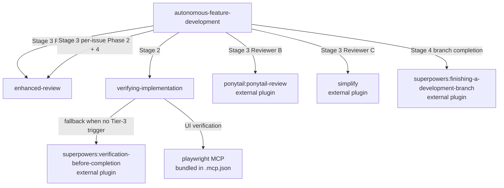
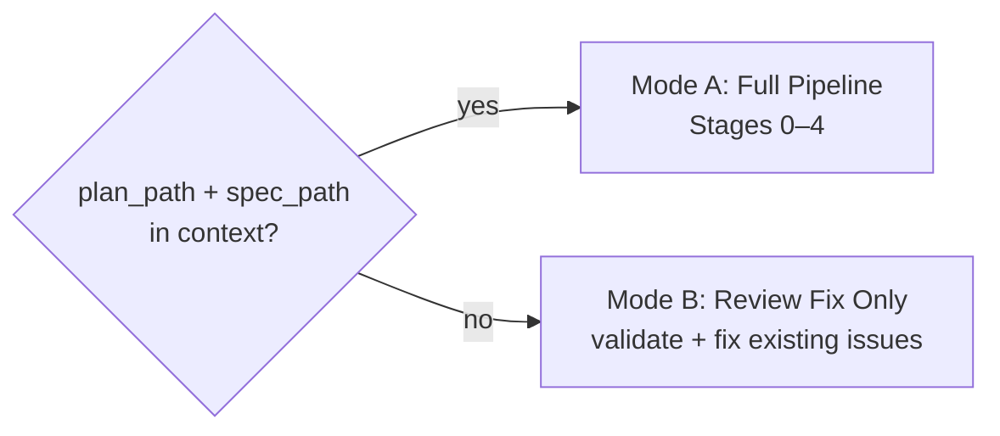

# Skills Reference

## Overview

| Skill                            | Entry Point                                      | Purpose                                                                                     | Trigger                                                                                                            |
| -------------------------------- | ------------------------------------------------ | ------------------------------------------------------------------------------------------- | ------------------------------------------------------------------------------------------------------------------ |
| `autonomous-feature-development` | `skills/autonomous-feature-development/SKILL.md` | Fully autonomous pipeline: parallel worktree implementation, verification, review, fix loop | After brainstorming/planning session with `plan_path` + `spec_path` ready; or after receiving code review feedback |
| `enhanced-review`                | `skills/enhanced-review/SKILL.md`                | Linus-style review for code, specs, or plans with five-why reflection before any verdict    | Before merging code; before implementing a spec or plan (shift-left); when something feels off                     |
| `verifying-implementation`       | `skills/verifying-implementation/SKILL.md`       | Boot the system and verify against acceptance criteria using a fresh subagent               | Work touches a running service; plan has a Verification section; AC describe observable runtime behavior           |

---

## Dependency Graph

**Required external plugins:**

- `superpowers` — used by `autonomous-feature-development` (Stage 4) and `verifying-implementation` (fallback). Install before invoking either skill.
- `ponytail` — used by `autonomous-feature-development` Stage 3 Reviewer B. Optional; skipped if absent.

---

## Skills

### `autonomous-feature-development`

Full pipeline from plan to merged branch. Two modes selected automatically:

**File structure:**

| File                  | Purpose                                                                                              |
| --------------------- | ---------------------------------------------------------------------------------------------------- |
| `SKILL.md`            | Mode selection, prerequisites, hard rules                                                            |
| `stage-impl.md`       | Stage 0 (guard/setup) + Stage 1 (parallel TDD worktrees)                                             |
| `stage-verify.md`     | Stage 2 (boot system, verify against spec, fix loop)                                                 |
| `stage-review-fix.md` | Stage 3 Mode A (spawn reviewers, consolidate, parallel fix) + Mode B (validate received issues, fix) |
| `stage-final.md`      | Stage 4 (lint/format, summary, commit, branch completion)                                            |

**Hard rules (both modes):**

- Never delete tests to make them pass.
- Squash merge only — never plain `git merge` on worktree branches.
- Always commit at the end, even partial (`wip:` prefix if any task failed).
- All verifiable signals must be green before advancing to the next stage.

---

### `enhanced-review`

Linus-style review with an evidence-first discipline: no verdict before five-why reflection.

**Detects target automatically** — code (diff/source), spec (prose requirements), or plan (ordered steps). Same process, different observation lens per target.

**Two-pass process:**

1. **Pass 1 — Observe**: descriptive only, no severity labels. Each observation gets a "why" tagged as fact or `[hypothesis — unverified]`.
2. **Pass 2 — Interrogate + Judge**: five-why chain per observation → verdict (🟢/🟡/🔴) last.

**File structure:**

| File                                | Purpose                                         |
| ----------------------------------- | ----------------------------------------------- |
| `SKILL.md`                          | Process, Linus philosophy, non-negotiable rules |
| `references/review-code.md`         | Observation lens for code reviews               |
| `references/review-spec.md`         | Observation lens for spec reviews               |
| `references/review-plan.md`         | Observation lens for plan reviews               |
| `references/five-why-reflection.md` | The five-why discipline and chain rules         |
| `references/output-format.md`       | Review output structure                         |
| `references/examples.md`            | Good/bad taste illustrations                    |

**Used internally by:** `autonomous-feature-development` Stage 3 (parallel reviewer + per-issue plan/code review phases).

---

### `verifying-implementation`

Gates "done" claims for work with runtime behavior. The implementer cannot judge their own work — a fresh subagent runs the system and verifies each AC.

**Three tiers:**

| Tier         | What                                 | Who                |
| ------------ | ------------------------------------ | ------------------ |
| 1 — Static   | lint / types / compile               | Implementer        |
| 2 — Tests    | unit / integration                   | Implementer        |
| 3 — Behavior | start system → exercise AC → observe | **Fresh subagent** |

Tier 3 is mandatory when any trigger fires. Tests passing alone is not done.

**Triggers (any one = must run):**

- Work touches a running service (backend, Docker, DB, UI, queues, jobs)
- Plan or spec has an explicit Verification section
- AC describe observable runtime behavior

**Only exemption:** pure-doc changes (no source files modified).

**File structure:**

| File                          | Purpose                                                    |
| ----------------------------- | ---------------------------------------------------------- |
| `SKILL.md`                    | Gate logic, triggers, exemptions, red flags                |
| `tier-3-procedure.md`         | Step-by-step behavior walk-through the subagent runs       |
| `subagent-template.md`        | Dispatch contract — prompt template for the fresh subagent |
| `acceptance-criteria-gate.md` | What to do when AC are missing or vague                    |

**Used internally by:** `autonomous-feature-development` Stage 2 (verification loop).
