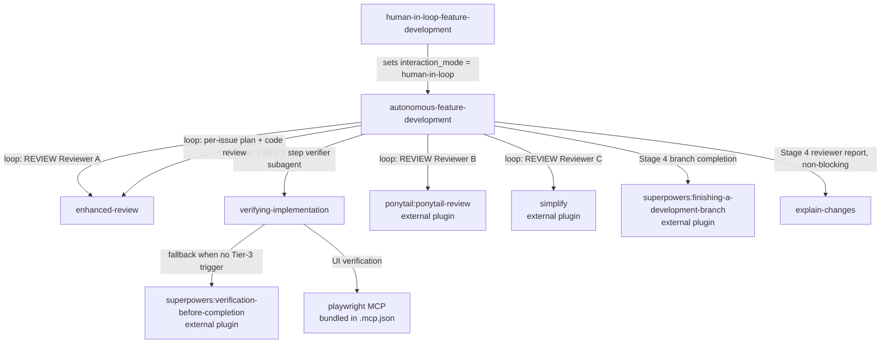
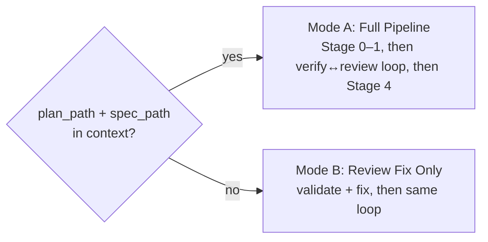

# Skills Reference

## Overview

| Skill                            | Entry Point                                      | Purpose                                                                                                | Trigger                                                                                                            |
| -------------------------------- | ------------------------------------------------ | ----------------------------------------------------------------------------------------------------- | ------------------------------------------------------------------------------------------------------------------ |
| `autonomous-feature-development` | `skills/autonomous-feature-development/SKILL.md` | Fully autonomous pipeline: parallel worktree implementation, then a capped verify↔review loop          | After brainstorming/planning session with `plan_path` + `spec_path` ready; or after receiving code review feedback |
| `human-in-loop-feature-development` | `skills/human-in-loop-feature-development/SKILL.md` | Thin wrapper: runs the engine with `interaction_mode = human-in-loop` — clarifies missing commands, hands off UI verification without MCP, leaves changes unstaged | Local, human-present development; can't auto-commit; missing `just`/Playwright MCP |
| `enhanced-review`                | `skills/enhanced-review/SKILL.md`                | Linus-style review for code, specs, or plans with five-why reflection before any verdict              | Before merging code; before implementing a spec or plan (shift-left); when something feels off                     |
| `verifying-implementation`       | `skills/verifying-implementation/SKILL.md`       | Boot the system and verify against acceptance criteria using a fresh subagent                         | Work touches a running service; plan has a Verification section; AC describe observable runtime behavior           |
| `cleanup-loop-logs`              | `skills/cleanup-loop-logs/SKILL.md`              | Human-only purge of one run's `.loop-logs/<id>/` logs + orphaned worktrees/branches                   | Human-triggered only (`disable-model-invocation`); never invoked by the model                                     |
| `explain-changes`                | `skills/explain-changes/SKILL.md`                | Generates a static HTML pitch-and-quiz report explaining a diff or a codebase area, ending in a self-check quiz | Human asks to explain/understand/review a diff, branch, or feature/module/mechanism/workflow; also auto-invoked at the end of `autonomous-feature-development` |

---

## Dependency Graph

`cleanup-loop-logs` is intentionally omitted — it has no skill dependencies, is
human-triggered only, and touches logs/worktrees/branches, never product code.

**Required external plugins:**

- `superpowers` — used by `autonomous-feature-development` (Stage 4) and `verifying-implementation` (fallback). Install before invoking either skill.
- `ponytail` — used by `autonomous-feature-development` Stage 3 Reviewer B. Optional; skipped if absent.

---

## Skills

### `autonomous-feature-development`

Full pipeline from plan to merged branch. Two modes selected automatically:

Stages 2 and 3 are a single **capped verify↔review loop** (≤5 iterations): each
iteration runs the VERIFY step, then REVIEW, fixes the actionable (blocking+important)
issues, and re-verifies — exiting when a review raises zero actionable issues. The run
is namespaced by a single `id` computed in Stage 0; all logs live under
`.loop-logs/<id>/`. See `001-agent-workflow.md` for the full loop diagram.

**File structure:**

| File                  | Purpose                                                                                                                  |
| --------------------- | ----------------------------------------------------------------------------------------------------------------------- |
| `SKILL.md`            | Mode selection, run `id`, prerequisites, hard rules (incl. orchestrator purity)                                         |
| `stage-impl.md`       | Stage 0 (guard/setup, compute `id`) + Stage 1 (parallel TDD worktrees)                                                  |
| `stage-verify.md`     | Loop VERIFY step: orchestrator spawns a verifier subagent (structured pass/fail), fixes via subagents, ≤3 inner rounds  |
| `stage-review-fix.md` | Loop control + Stage 3 REVIEW (spawn reviewers, consolidate, write `code-review/round-<N>.md`, parallel fix) + Mode B entry |
| `stage-final.md`      | Stage 4 (lint/format, summary with loop iterations + deferred minors, decisions log, reviewer report, commit, branch completion) |
| `log-schema.md`       | Single source of truth for the task log format                                                                          |
| `log-sample.md`       | Two-attempt example for agents writing task logs                                                                        |

**Hard rules (both modes):**

- Never delete tests to make them pass.
- Squash merge only — never plain `git merge` on worktree branches.
- `interaction_mode == autonomous`: always commit at the end, even partial (`wip:` prefix if any task failed); `human-in-loop`: leave changes unstaged for the human.
- All verifiable signals must be green before advancing to the next stage.
- Ambiguous? Subagents always assume + comment; the orchestrator does likewise when `autonomous`, and clarifies at the three junctures when `human-in-loop`.
- **Orchestrator purity:** the orchestrator never reads, writes, or executes product code
  or quality checks (lint/test/verify) or reviews — every such action is delegated to a
  single-responsibility subagent; the agent that implements a fix never reviews it. The
  orchestrator may do git plumbing and write the run's log/state files.

---

### `human-in-loop-feature-development`

Thin wrapper for local, human-present runs. It sets `interaction_mode =
human-in-loop` and invokes `autonomous-feature-development`; the engine owns every
stage. Mirrors the `/grill-me` → `/grilling` delegation pattern, with the one
addition that the engine reads a flag.

**The `interaction_mode` flag** (`autonomous` default | `human-in-loop`) is
distinct from Mode A / Mode B pipeline selection. The orchestrator branches on it at
**exactly three junctures**; everywhere else is shared. **Subagents never branch on
it** — they receive concrete inputs (resolved commands, `mcp_available`) and stay
autonomous.

**Stage 2 is gated, not merely instructed.** When the verifier reports `blocked`
acceptance criteria it lacked the capability to check, `human-in-loop` writes a human
checklist and records `last_outcome: "awaiting_human"` in
`.loop-logs/<id>/tasks/verification-state.json`. The Stage 2 Clearance Gate at the top
of the review step admits reviewers only when `last_outcome == "pass"`, so a missing,
stale, or `awaiting_human` state file halts the pipeline. The gate fails closed.

| Juncture | `autonomous` | `human-in-loop` |
| -------- | ------------ | --------------- |
| Stage 0 — unresolved required command (`lint`/`test`) | Hard-stop listing the unresolved names | Ask the user, persist to a `## Commands` section in `CLAUDE.md`, continue |
| Stage 2 — UI acceptance criterion needs Playwright MCP but it is absent | Hard-stop (preflight AC-scan + per-AC backstop) | Verifier auto-verifies non-UI ACs and returns them as `blocked[]` facts; orchestrator writes `.loop-logs/<id>/verifications/verification-<round>.md`, sets `last_outcome: "awaiting_human"`, and **pauses**. The human records each `Result:` in that file and replies `continue`; the Stage 2 Clearance Gate blocks Stage 3 until then. Any `FAIL` folds back into the fix loop |
| Stage 4 — commit | `git add -A` + commit (or `wip:` partial), then branch completion | Never commit — `git reset --mixed <base_sha>` leaves everything unstaged; skip branch completion; prompt the human |

Command resolution and the commit handoff apply to both Mode A and Mode B; the
Stage 0 MCP AC-scan is Mode A only (Mode B has no `spec_path`), though the
verify-time per-AC MCP backstop still applies.

**File structure:**

| File       | Purpose                                                        |
| ---------- | ------------------------------------------------------------- |
| `SKILL.md` | Clarify/pause contract + invoke the engine with `interaction_mode = human-in-loop` |

---

### `enhanced-review`

Linus-style review with an evidence-first discipline: no verdict before five-why reflection.

**Detects target automatically** — code (diff/source), spec (prose requirements), or plan (ordered steps). Same process, different observation lens per target.

**Two-pass process:**

1. **Pass 1 — Observe**: descriptive only, no severity labels. Each observation gets a "why" tagged as fact or `[hypothesis — unverified]`.
2. **Pass 2 — Interrogate + Judge**: five-why chain per observation → verdict (🟢/🟡/🔴) last.

**File structure:**

| File                                | Purpose                                         |
| ----------------------------------- | ----------------------------------------------- |
| `SKILL.md`                          | Process, Linus philosophy, non-negotiable rules |
| `references/review-code.md`         | Observation lens for code reviews               |
| `references/review-spec.md`         | Observation lens for spec reviews               |
| `references/review-plan.md`         | Observation lens for plan reviews               |
| `references/five-why-reflection.md` | The five-why discipline and chain rules         |
| `references/output-format.md`       | Review output structure                         |
| `references/examples.md`            | Good/bad taste illustrations                    |

**Used internally by:** `autonomous-feature-development` loop REVIEW step (parallel reviewer + per-issue plan/code review phases). Each invocation runs in its own single-responsibility subagent, distinct from the agent that implemented the change.

---

### `verifying-implementation`

Gates "done" claims for work with runtime behavior. The implementer cannot judge their own work — a fresh subagent runs the system and verifies each AC.

**Three tiers:**

| Tier         | What                                 | Who                |
| ------------ | ------------------------------------ | ------------------ |
| 1 — Static   | lint / types / compile               | Implementer        |
| 2 — Tests    | unit / integration                   | Implementer        |
| 3 — Behavior | start system → exercise AC → observe | **Fresh subagent** |

Tier 3 is mandatory when any trigger fires. Tests passing alone is not done.

**Triggers (any one = must run):**

- Work touches a running service (backend, Docker, DB, UI, queues, jobs)
- Plan or spec has an explicit Verification section
- AC describe observable runtime behavior

**Only exemption:** pure-doc changes (no source files modified).

**File structure:**

| File                          | Purpose                                                    |
| ----------------------------- | ---------------------------------------------------------- |
| `SKILL.md`                    | Gate logic, triggers, exemptions, red flags                |
| `tier-3-procedure.md`         | Step-by-step behavior walk-through the subagent runs       |
| `subagent-template.md`        | Dispatch contract — prompt template for the fresh subagent |
| `acceptance-criteria-gate.md` | What to do when AC are missing or vague                    |

**Used internally by:** `autonomous-feature-development` loop VERIFY step. The orchestrator does not run this skill directly — it spawns a **verifier subagent** that runs the skill and returns structured `{ outcome, failures }`. In Mode B (no `spec_path`) the verifier runs regression-only: boot + exercise the changed paths, no spec-acceptance match.

---

### `cleanup-loop-logs`

Human-triggered cleanup for one autonomous-development run. Frontmatter sets
`disable-model-invocation: true`, so the orchestrator can never invoke it — it only runs
when a human asks.

Deletes the run's `.loop-logs/<id>/` log tree and prunes the worktrees/branches that run
left behind. Touches logs, worktrees, and branches only — never product code.

**Flow:**

1. **Select target** — use the passed `id`, derive it from a passed plan path, or (no
   arg) list every run newest-first and ask which `id` to clean, or `all`.
2. **Gather & confirm** — print the exact log tree, worktrees, and branches that will be
   removed; wait for an explicit "yes" (deletion is irreversible).
3. **Prune orphans** — `git worktree remove --force` + `git branch -D` for each approved
   leftover.
4. **Delete logs** — `rm -rf .loop-logs/<id>/` (done last, so task ids stay available for
   worktree/branch attribution in steps 2–3).

**File structure:**

| File       | Purpose                                                  |
| ---------- | -------------------------------------------------------- |
| `SKILL.md` | Target selection, confirmation gate, prune + delete flow |

### `explain-changes`

Generates a self-contained HTML report — a narrative explanation plus a
self-check quiz — either for a diff (**diff-review** mode) or an existing
codebase area (**explainer** mode). Model-invoked, and also called by
`autonomous-feature-development` at the end of Stage 4 (non-blocking).

**Flow:**

1. **Resolve mode** — inferred from the request, or fixed to diff-review when
   auto-triggered.
2. **Resolve inputs** — diff scope + plan/spec/logs for diff-review; a
   confirmed codebase area for explainer.
3. **Resolve output path** — `temp/` (standalone), or
   `.loop-logs/<id>/reports/` (loop-referencing or auto-triggered).
4. **Spawn one subagent** — gathers context and drafts structured findings +
   quiz content as JSON (skipped for an empty diff).
5. **Render** — fills `template.html` with the subagent's JSON and writes the
   report.

**File structure:**

| File                 | Purpose                                                        |
| -------------------- | --------------------------------------------------------------- |
| `SKILL.md`           | Mode/input/output resolution, subagent dispatch, render steps  |
| `template.html`      | Static HTML/CSS report template, no JS                         |
| `subagent-brief.md`  | JSON schema + instructions for the gather+draft subagent       |
