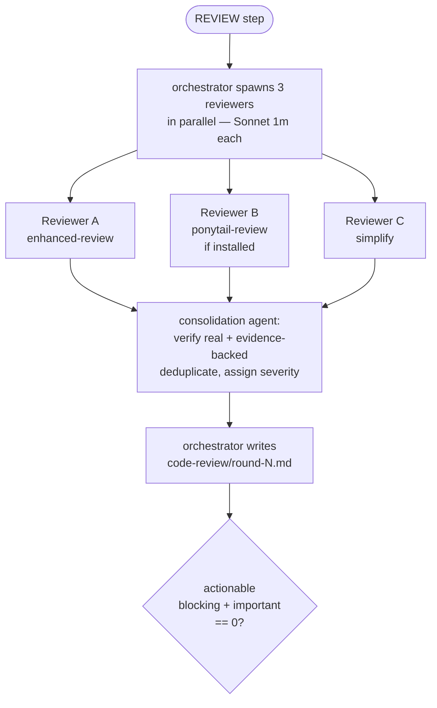
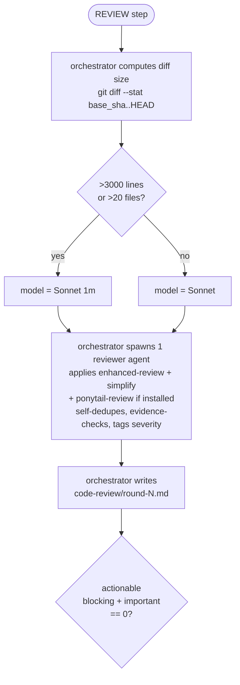

# Review Loop Cost Optimization Implementation Plan

> **For agentic workers:** REQUIRED SUB-SKILL: Use superpowers:subagent-driven-development (recommended) or superpowers:executing-plans to implement this plan task-by-task. Steps use checkbox (`- [ ]`) syntax for tracking.

**Goal:** Cut `autonomous-feature-development`'s Stage 3 review-loop cost by replacing its 3-reviewer-agent + consolidator panel with one multi-skill reviewer agent, and by severity-gating the per-issue fix pipeline so `important` issues skip the plan-approval gate.

**Architecture:** Every loop iteration, the orchestrator spawns one reviewer agent (model tier chosen from a `git diff --stat` size proxy) that applies every installed review skill against the full cumulative diff, self-dedupes and evidence-checks its own findings, and returns the final severity-tagged issue table directly — no separate consolidation call. The per-issue fix pipeline branches on severity: `blocking` keeps the existing 5-phase Plan→Review-plan→Implement→Review-impl→Verify pipeline; `important` collapses to Implement→Review→Verify.

**Tech Stack:** Markdown skill definitions (the product), TypeScript + vitest on Node 20+ (the verification harness), pnpm.

## Global Constraints

Copied verbatim from `docs/superpowers/specs/2026-07-16-review-loop-cost-optimization-design.md`:

- Every iteration reviews the **full cumulative diff** (`base_sha..HEAD`) — no scoped/incremental diffing, no separate "final confirmation" pass.
- The single reviewer agent applies `enhanced-review` and `simplify` always; `ponytail-review` only if the `ponytail` plugin is installed (skip the skill, not the reviewer, if absent).
- No separate consolidation agent. The reviewer self-dedupes, evidence-checks (file:line, not hypothetical), and severity-tags its own findings.
- Model tier: standard Sonnet by default; escalate to `Sonnet[1m]` only if `git diff --stat base_sha..HEAD` shows > 3000 changed lines OR > 20 files changed.
- Fix pipeline severity gate: `blocking` = full 5-phase pipeline (unchanged); `important` = collapsed 3-phase pipeline (Implement→Review→Verify, no plan/plan-review gate); `minor` = unchanged, deferred.
- No full-diff confirmation pass runs on cap-exhaustion (5-iteration cap hit with issues still open).
- `stage-verify.md`, `stage-impl.md`, `stage-final.md`, and `human-in-loop-feature-development/SKILL.md` are **not modified**.

## File Structure

| File | Responsibility | Action |
| --- | --- | --- |
| `tests/regression-tests/check-review-loop-cost.test.ts` | Encodes 5 static assertions (`C1`–`C5`) from the spec's Verification section as vitest `it()` blocks. | Create |
| `skills/autonomous-feature-development/stage-review-fix.md` | Part 1 (spawn a single multi-skill reviewer + model-tier decision), code-review log template, Part 2 (severity-gated fix pipeline). | Modify |
| `skills/autonomous-feature-development/SKILL.md` | Mode A table row wording; `ponytail` prerequisite note. | Modify |
| `docs/architecture/001-agent-workflow.md` | Stage 3 REVIEW mermaid flowchart; Part 2 fix-pipeline mermaid flowchart (severity branch). | Modify |
| `docs/architecture/002-skills.md` | Dependency-graph mermaid edges; "Required external plugins" `ponytail` bullet; `autonomous-feature-development` file-structure table row; `enhanced-review` "Used internally by" line. | Modify |
| `README.md` | Prerequisites table `ponytail` row. | Modify |
| `CHANGELOG.md` | Entry under a new `[Unreleased]` heading. | Modify |
| `docs/user-feedbacks/2026-07-16-user-feedback.md` | Mark Issue 1 resolved. | Modify |

**Why a committed harness rather than ad-hoc greps.** This repo ships prompts, not code — nothing else fails when a stage file drifts. Following the existing `tests/regression-tests/check-stage2-gate.test.ts` pattern, the new harness is the only mechanism that makes assertions `C1`–`C5` enforceable the next time someone edits Stage 3.

**Note on the spec's 6th assertion.** The spec's Verification section also lists "`stage-verify.md`, `stage-impl.md`, `stage-final.md` are byte-identical to their pre-change versions." That's not meaningfully checkable as a *permanent* regression test — those files will legitimately change in unrelated future PRs, and a snapshot test would start failing for reasons that have nothing to do with this change. It's checked once, manually, in Task 7 below (`git diff --stat` on those three paths must be empty), the same way the precedent plan's "Note on A5" handled an unencodable spec assertion.

## Assertion → Task Map

| ID | Assertion | Made green by |
| --- | --- | --- |
| C1 | None of the 5 affected docs contain stale 3-reviewer/consolidator vocabulary | Tasks 2, 3, 4, 5, 6 (fully green only after Task 6) |
| C2 | `stage-review-fix.md` documents the single reviewer agent's skill list, self-consolidation responsibility, and output schema | Task 2 |
| C3 | `stage-review-fix.md` documents the `git diff --stat` model-tier decision step and its exact thresholds | Task 2 |
| C4 | `stage-review-fix.md` documents two severity-keyed phase counts (blocking = 5, important = 3) | Task 3 |
| C5 | `SKILL.md`'s `ponytail` prerequisite note frames it as an optional skill the review agent applies, not "one of three parallel reviewers" | Task 4 |

---

### Task 1: Static assertion harness (write failing tests first)

**Files:**
- Create: `tests/regression-tests/check-review-loop-cost.test.ts`

**Interfaces:**
- Consumes: nothing.
- Produces: `pnpm test`, extended by 5 new `it()` blocks named `C1:`…`C5:`. `pnpm test -- -t "C1:|C2:"` runs a subset — the `--` is required, or pnpm silently drops the filter and runs everything. Every later task runs this.

- [ ] **Step 1: Write the failing test harness**

Create `tests/regression-tests/check-review-loop-cost.test.ts`:

```ts
/**
 * Static assertions for the Stage 3 review-loop cost optimization.
 * Spec: docs/superpowers/specs/2026-07-16-review-loop-cost-optimization-design.md
 *
 * These skills are prompts, not code. This harness is the only thing that can
 * fail when a stage file drifts back to the pre-optimization 3-reviewer contract.
 */
import { readFileSync, existsSync } from "node:fs";
import { dirname, join } from "node:path";
import { fileURLToPath } from "node:url";
import { describe, it, expect } from "vitest";

const ROOT = join(dirname(fileURLToPath(import.meta.url)), "..", "..");

const AFD = "skills/autonomous-feature-development";
const REVIEW_FIX = `${AFD}/stage-review-fix.md`;
const ENGINE = `${AFD}/SKILL.md`;
const ARCH_WORKFLOW = "docs/architecture/001-agent-workflow.md";
const ARCH_SKILLS = "docs/architecture/002-skills.md";
const README = "README.md";

const ALL_AFFECTED_DOCS = [REVIEW_FIX, ENGINE, ARCH_WORKFLOW, ARCH_SKILLS, README];

function read(relPath: string): string {
  const abs = join(ROOT, relPath);
  if (!existsSync(abs)) throw new Error(`harness target missing: ${relPath}`);
  return readFileSync(abs, "utf8");
}

const docsContaining = (needle: string) =>
  ALL_AFFECTED_DOCS.filter((f) => read(f).includes(needle));

describe("stage 3 review-loop cost optimization", () => {
  it("C1: no affected doc keeps the stale 3-reviewer/consolidator vocabulary", () => {
    const stale = [
      "Reviewer A",
      "Reviewer B",
      "Reviewer C",
      "three parallel reviewers",
      "consolidation agent",
      "reviewers + consolidator",
      "spawns 3 reviewer",
      "spawn reviewers",
      "Reviewers were NOT spawned",
      "admits reviewers only",
    ];
    for (const phrase of stale) {
      expect(docsContaining(phrase), `stale phrase still present: "${phrase}"`).toEqual([]);
    }
  });

  it("C2: stage-review-fix.md documents the single multi-skill reviewer", () => {
    const s = read(REVIEW_FIX);
    const required = [
      "one reviewer agent",
      "enhanced-review",
      "simplify",
      "ponytail:ponytail-review",
      "self-dedupes",
      "evidence-backed",
      "no separate consolidation step",
    ];
    const missing = required.filter((w) => !s.includes(w));
    expect(missing, "single-reviewer contract elements").toEqual([]);
  });

  it("C3: stage-review-fix.md documents the model-tier decision step", () => {
    const s = read(REVIEW_FIX);
    const required = ["git diff --stat", "3000", "20", "Sonnet[1m]"];
    const missing = required.filter((w) => !s.includes(w));
    expect(missing, "model-tier decision elements").toEqual([]);
  });

  it("C4: stage-review-fix.md documents severity-keyed phase counts", () => {
    const s = read(REVIEW_FIX);
    const required = [
      "full 5-phase pipeline",
      "collapsed 3-phase pipeline",
      "no plan-approval gate",
    ];
    const missing = required.filter((w) => !s.includes(w));
    expect(missing, "severity-gated pipeline markers").toEqual([]);
  });

  it("C5: SKILL.md frames ponytail as an optional skill, not a dedicated reviewer", () => {
    const s = read(ENGINE);
    expect(s, "still describes ponytail as one of three reviewers").not.toContain(
      "one of three parallel reviewers",
    );
    expect(s, "missing the skill-the-review-agent-applies framing").toContain(
      "the single Stage 3 review agent applies",
    );
  });
});
```

- [ ] **Step 2: Run the new suite and confirm it fails red**

Run: `pnpm test -- -t "C1:|C2:|C3:|C4:|C5:"`
Expected: all 5 new assertions FAIL (the stale 3-reviewer text is still in place; the new vocabulary doesn't exist yet).

- [ ] **Step 3: Confirm the existing suite is untouched**

Run: `pnpm test -- -t "A1:|A2:|A3:|A4:|A5:|A6:|A7:|A8:|A9:|A10:|A11:|A12:|A13:"`
Expected: `13 passed (13)` — this change must not regress the Stage 2 human-verification-gate harness.

- [ ] **Step 4: Commit**

```bash
git add tests/regression-tests/check-review-loop-cost.test.ts
git commit -m "test: add failing harness for review-loop cost optimization"
```

---

### Task 2: Single multi-skill reviewer replaces the 3-reviewer panel + consolidator

**Files:**
- Modify: `skills/autonomous-feature-development/stage-review-fix.md`

**Interfaces:**
- Consumes: nothing from other tasks.
- Produces: the "Spawn the review agent" section and updated code-review log template that Task 3 sits below unchanged.

- [ ] **Step 1: Replace the "Spawn fresh reviewers" section**

In `skills/autonomous-feature-development/stage-review-fix.md`, find this block (right after the "Stage 2 Clearance Gate" section, under `### Spawn fresh reviewers`):

```markdown
### Spawn fresh reviewers

The orchestrator spawns 3 reviewer subagents **in parallel** (Sonnet[1m] each). Each
reviews independently and returns raw findings:

| Agent      | Skill                                                                |
| ---------- | --------------------------------------------------------------------- |
| Reviewer A | `enhanced-review`                                                    |
| Reviewer B | `ponytail:ponytail-review` (skip if `ponytail` plugin not installed) |
| Reviewer C | `simplify`                                                           |

The orchestrator passes all raw findings to a **consolidation agent**, which:

1. Verifies each issue is real and evidence-backed (not hypothetical).
2. Deduplicates overlapping findings.
3. Returns a validated issue list, each tagged severity blocking / important / minor.
```

Replace it with:

````markdown
### Spawn the review agent

**Model-tier decision (orchestrator git plumbing, no subagent):**

```bash
git diff --stat <base_sha>..HEAD
```

If total changed lines > 3000, OR files changed > 20: use `Sonnet[1m]` for the
reviewer agent below. Otherwise: use standard Sonnet.

The orchestrator spawns **one** reviewer agent (at the resolved model tier) against
the full cumulative diff (`<base_sha>..HEAD`). It applies every installed review
skill against that same diff read:

| Skill                      | Always applied?                                                    |
| -------------------------- | -------------------------------------------------------------------- |
| `enhanced-review`          | yes                                                                   |
| `simplify`                 | yes                                                                   |
| `ponytail:ponytail-review` | only if the `ponytail` plugin is installed — skip this skill (not the whole review) if absent |

The agent:

1. Applies each skill above against the same diff read.
2. Self-dedupes overlapping findings surfaced under different skill lenses.
3. Verifies each surviving finding is evidence-backed (file:line, not hypothetical)
   before including it.
4. Tags each finding with severity: `blocking` / `important` / `minor`.
5. Returns the final issue table directly. There is no separate consolidation
   step — the reviewer's own output is the log's "Findings" section verbatim.
````

- [ ] **Step 2: Fix the two other stale references in the same file**

`grep -n -i "reviewer\|consolidat" skills/autonomous-feature-development/stage-review-fix.md` turns up two more spots outside the section replaced in Step 1:

In the Loop Control pseudocode block, find:

```
  2. REVIEW  — run the Stage 2 Clearance Gate below, then Part 1: spawn reviewers +
     consolidator, then write .loop-logs/<id>/code-review/round-<iteration>.md.
```

Replace with:

```
  2. REVIEW  — run the Stage 2 Clearance Gate below, then Part 1: spawn the review
     agent, then write .loop-logs/<id>/code-review/round-<iteration>.md.
```

In the Stage 2 Clearance Gate's STOP block, find:

```
Stage 2 is not cleared. Reviewers were NOT spawned.
```

Replace with:

```
Stage 2 is not cleared. The review agent was NOT spawned.
```

- [ ] **Step 3: Replace the code-review log template**

Find the "Orchestrator writes the code-review log" section's template:

````markdown
### Orchestrator writes the code-review log

The orchestrator (NOT the consolidator) writes
`.loop-logs/<id>/code-review/round-<iteration>.md`:

```markdown
# Code Review — Round <iteration>

**Timestamp:** <ISO>
**Loop iteration:** <iteration> of ≤5

## Raw findings

### Reviewer A — enhanced-review

<raw>
### Reviewer B — ponytail
<raw, or: skipped — plugin not installed>
### Reviewer C — simplify
<raw>

## Consolidated issues

| ID  | Severity                 | Summary | Evidence (file:line) |
| --- | ------------------------ | ------- | -------------------- |
| ... | blocking/important/minor | ...     | ...                  |

## Disposition

- Actionable (blocking + important) — to fix this iteration: <ids, or "none">
- Deferred (minor — NOT handled yet): <ids + summaries, or "none">
```
````

Replace it with:

````markdown
### Orchestrator writes the code-review log

The orchestrator (NOT the reviewer agent) writes
`.loop-logs/<id>/code-review/round-<iteration>.md`, using the reviewer's output
directly — there is no separate consolidation step to derive it from:

```markdown
# Code Review — Round <iteration>

**Timestamp:** <ISO>
**Loop iteration:** <iteration> of ≤5
**Model tier:** <Sonnet | Sonnet[1m]> (diff: <N> lines / <M> files changed)

## Findings

| ID  | Severity                 | Summary | Evidence (file:line) |
| --- | ------------------------ | ------- | -------------------- |
| ... | blocking/important/minor | ...     | ...                  |

## Disposition

- Actionable (blocking + important) — to fix this iteration: <ids, or "none">
- Deferred (minor — NOT handled yet): <ids + summaries, or "none">
```
````

- [ ] **Step 4: Run the new suite and confirm C2 and C3 pass**

Run: `pnpm test -- -t "C2:|C3:"`
Expected: `2 passed (2)`.

- [ ] **Step 5: Confirm C1, C4, C5 are still red (expected — other files not yet touched)**

Run: `pnpm test -- -t "C1:|C4:|C5:"`
Expected: FAIL — `C1` still finds stale phrases in `SKILL.md`/architecture docs/README; `C4` and `C5` target files not yet edited in this task.

- [ ] **Step 6: Commit**

```bash
git add skills/autonomous-feature-development/stage-review-fix.md
git commit -m "feat(stage-review-fix): single multi-skill reviewer replaces 3-reviewer panel"
```

---

### Task 3: Severity-gate the per-issue fix pipeline

**Files:**
- Modify: `skills/autonomous-feature-development/stage-review-fix.md`

**Interfaces:**
- Consumes: nothing new.
- Produces: the severity-gated "Per-Issue Fix Pipeline" section that `SEV` branching in the architecture diagram (Task 5) documents.

- [ ] **Step 1: Replace the "Per-Issue Fix Pipeline" section**

Find:

```markdown
### Per-Issue Fix Pipeline

Use **separate single-responsibility agents per phase** — the agent that implements a
fix is never the agent that reviews it:

- **Phase 1 — Plan** (Planner agent): root cause + a concrete 3–5 bullet plan.
- **Phase 2 — Review plan** (enhanced-review agent): if issues → back to Phase 1 with
  feedback; repeat until approved.
- **Phase 3 — Implement** (Implementer agent): TDD — write failing test, confirm it
  fails for the expected reason, write minimal implementation, then `<lint_cmd>` and
  `<test_cmd>` both exit 0. Commit `fix(<scope>): <issue description>`.
- **Phase 4 — Review implementation** (enhanced-review agent): review the code change;
  if issues → back to Phase 3; repeat until approved.
- **Phase 5 — Verify** (Implementer agent): `<lint_cmd>` + `<test_cmd>` one final
  time; mark resolved. The orchestrator never runs lint/test itself.
```

Replace it with:

```markdown
### Per-Issue Fix Pipeline (severity-gated)

Use **separate single-responsibility agents per phase** — the agent that implements a
fix is never the agent that reviews it. Phase count depends on the issue's severity.

**`blocking` issues — full 5-phase pipeline:**

- **Phase 1 — Plan** (Planner agent): root cause + a concrete 3–5 bullet plan.
- **Phase 2 — Review plan** (enhanced-review agent): if issues → back to Phase 1 with
  feedback; repeat until approved.
- **Phase 3 — Implement** (Implementer agent): TDD — write failing test, confirm it
  fails for the expected reason, write minimal implementation, then `<lint_cmd>` and
  `<test_cmd>` both exit 0. Commit `fix(<scope>): <issue description>`.
- **Phase 4 — Review implementation** (enhanced-review agent): review the code change;
  if issues → back to Phase 3; repeat until approved.
- **Phase 5 — Verify** (Implementer agent): `<lint_cmd>` + `<test_cmd>` one final
  time; mark resolved. The orchestrator never runs lint/test itself.

**`important` issues — collapsed 3-phase pipeline (no plan-approval gate):**

- **Phase 1 — Implement** (Implementer agent): TDD — write failing test, confirm it
  fails for the expected reason, write minimal implementation, then `<lint_cmd>` and
  `<test_cmd>` both exit 0. Commit `fix(<scope>): <issue description>`.
- **Phase 2 — Review** (enhanced-review agent): review the code change; if issues →
  back to Phase 1; repeat until approved.
- **Phase 3 — Verify** (Implementer agent): `<lint_cmd>` + `<test_cmd>` one final
  time; mark resolved. The orchestrator never runs lint/test itself.

`minor` issues are never fixed in-loop, regardless of pipeline — see Loop Control.
```

- [ ] **Step 2: Run the new suite and confirm C4 passes**

Run: `pnpm test -- -t "C4:"`
Expected: `1 passed (1)`.

- [ ] **Step 3: Commit**

```bash
git add skills/autonomous-feature-development/stage-review-fix.md
git commit -m "feat(stage-review-fix): severity-gate the per-issue fix pipeline"
```

---

### Task 4: Sync SKILL.md's reviewer-roster wording

**Files:**
- Modify: `skills/autonomous-feature-development/SKILL.md`

**Interfaces:**
- Consumes: nothing new.
- Produces: the `ponytail` prerequisite wording that Task 6's `002-skills.md` "Required external plugins" bullet and Task 7's README row must stay consistent with.

- [ ] **Step 1: Update the Prerequisites section**

Find:

```markdown
- **`ponytail`** (optional) — used as one of three parallel reviewers in Stage 3
  Mode A (`ponytail:ponytail-review`). If absent, skip that reviewer and proceed
  with the remaining two.
```

Replace with:

```markdown
- **`ponytail`** (optional) — one of the skills the single Stage 3 review agent
  applies (`ponytail:ponytail-review`). If absent, skip that skill and proceed
  with the remaining ones.
```

- [ ] **Step 2: Update the Mode A stage table row**

Find (in the Mode A table, Stage row `2 + 3`):

```markdown
| 2 + 3 | `./stage-review-fix.md` | **Capped verify↔review loop** (≤5 iterations): each iteration runs the VERIFY step in `./stage-verify.md`, then spawns fresh reviewers + consolidator, writes a code-review log, fixes actionable (blocking+important) issues, and re-verifies. Exits when a review raises zero actionable issues. |
```

Replace with:

```markdown
| 2 + 3 | `./stage-review-fix.md` | **Capped verify↔review loop** (≤5 iterations): each iteration runs the VERIFY step in `./stage-verify.md`, then spawns a single multi-skill review agent, writes a code-review log, fixes actionable (blocking+important) issues via a severity-gated pipeline, and re-verifies. Exits when a review raises zero actionable issues. |
```

- [ ] **Step 3: Run the new suite and confirm C5 passes**

Run: `pnpm test -- -t "C5:"`
Expected: `1 passed (1)`.

- [ ] **Step 4: Confirm C1 is still red (architecture docs and README not yet touched)**

Run: `pnpm test -- -t "C1:"`
Expected: FAIL — stale phrases remain in `001-agent-workflow.md`, `002-skills.md`, `README.md`.

- [ ] **Step 5: Commit**

```bash
git add skills/autonomous-feature-development/SKILL.md
git commit -m "docs(SKILL): sync reviewer-roster wording with single multi-skill agent"
```

---

### Task 5: Sync `docs/architecture/001-agent-workflow.md`

**Files:**
- Modify: `docs/architecture/001-agent-workflow.md`

**Interfaces:**
- Consumes: the section headings/behavior from Tasks 2–3 (this task only re-diagrams what they already implemented).
- Produces: nothing consumed by later tasks.

- [ ] **Step 1: Replace the Stage 3 REVIEW mermaid flowchart**

Find:

````markdown

````

Replace with:

````markdown

````

Leave everything below `AQ` in that flowchart (the `AQ -->|yes| BACK` / `AQ -->|no| FIXPAR` branches) unchanged.

- [ ] **Step 2: Replace the fix-pipeline mermaid flowchart's phase chain**

Find:

```markdown
    FIXPAR --> FI1[Issue fix worktree 1]
    FIXPAR --> FI2[Issue fix worktree 2]
    FIXPAR --> FIN[Issue fix worktree N]

    FI1 --> PH1[Phase 1: Planner agent\nroot cause + plan]
    PH1 --> PH2[Phase 2: enhanced-review agent\nreview plan]
    PH2 --> PH2OK{plan\napproved?}
    PH2OK -->|no| PH1
    PH2OK -->|yes| PH3[Phase 3: Implementer agent\nTDD: test → impl → lint + test]
    PH3 --> PH4[Phase 4: enhanced-review agent\nreview code]
    PH4 --> PH4OK{code\napproved?}
    PH4OK -->|no| PH3
    PH4OK -->|yes| PH5[Phase 5: Implementer agent\nverify: lint_cmd + test_cmd]
    PH5 --> SMF[squash merge fix\ninto branch]

    FI2 -.->|same phases| SMF
    FIN -.->|same phases| SMF
```

Replace with:

```markdown
    FIXPAR --> FI1[Issue fix worktree 1]
    FIXPAR --> FI2[Issue fix worktree 2]
    FIXPAR --> FIN[Issue fix worktree N]

    FI1 --> SEV{severity?}
    SEV -->|blocking| PH1[Phase 1: Planner agent\nroot cause + plan]
    PH1 --> PH2[Phase 2: enhanced-review agent\nreview plan]
    PH2 --> PH2OK{plan\napproved?}
    PH2OK -->|no| PH1
    PH2OK -->|yes| PH3[Phase 3: Implementer agent\nTDD: test → impl → lint + test]
    PH3 --> PH4[Phase 4: enhanced-review agent\nreview code]
    PH4 --> PH4OK{code\napproved?}
    PH4OK -->|no| PH3
    PH4OK -->|yes| PH5[Phase 5: Implementer agent\nverify: lint_cmd + test_cmd]
    PH5 --> SMF[squash merge fix\ninto branch]

    SEV -->|important| IH1[Phase 1: Implementer agent\nTDD: test → impl → lint + test]
    IH1 --> IH2[Phase 2: enhanced-review agent\nreview code]
    IH2 --> IH2OK{code\napproved?}
    IH2OK -->|no| IH1
    IH2OK -->|yes| IH3[Phase 3: Implementer agent\nverify: lint_cmd + test_cmd]
    IH3 --> SMF

    FI2 -.->|same, by severity| SMF
    FIN -.->|same, by severity| SMF
```

- [ ] **Step 3: Commit**

```bash
git add docs/architecture/001-agent-workflow.md
git commit -m "docs(architecture): sync agent-workflow diagrams with single reviewer + severity gate"
```

---

### Task 6: Sync `docs/architecture/002-skills.md`

**Files:**
- Modify: `docs/architecture/002-skills.md`

**Interfaces:**
- Consumes: nothing new.
- Produces: nothing consumed by later tasks. Completing this task makes `C1` fully green (the last affected doc still carrying stale vocabulary besides README).

- [ ] **Step 1: Update the Dependency Graph mermaid edges**

Find:

```markdown
    AFD -->|loop: REVIEW Reviewer A| ER
    AFD -->|loop: REVIEW Reviewer B| PT
    AFD -->|loop: REVIEW Reviewer C| SM
    AFD -->|loop: per-issue plan + code review| ER
```

Replace with:

```markdown
    AFD -->|loop: REVIEW agent applies skill| ER
    AFD -->|loop: REVIEW agent applies skill, if installed| PT
    AFD -->|loop: REVIEW agent applies skill| SM
    AFD -->|loop: per-issue fix review, severity-gated| ER
```

- [ ] **Step 2: Update the "Required external plugins" bullet**

Find:

```markdown
- `ponytail` — used by `autonomous-feature-development` Stage 3 Reviewer B. Optional; skipped if absent.
```

Replace with:

```markdown
- `ponytail` — one of the skills the single Stage 3 review agent applies. Optional; skipped if absent.
```

- [ ] **Step 3: Update the `autonomous-feature-development` file-structure table row**

Find:

```markdown
| `stage-review-fix.md` | Loop control + Stage 3 REVIEW (spawn reviewers, consolidate, write `code-review/round-<N>.md`, parallel fix) + Mode B entry |
```

Replace with:

```markdown
| `stage-review-fix.md` | Loop control + Stage 3 REVIEW (spawn a single multi-skill review agent, write `code-review/round-<N>.md`, severity-gated parallel fix) + Mode B entry |
```

- [ ] **Step 4: Fix the remaining stale reference in the `human-in-loop-feature-development` section**

Find (in the "Stage 2 is gated, not merely instructed" paragraph):

```markdown
of the review step admits reviewers only when `last_outcome == "pass"`, so a missing,
```

Replace with:

```markdown
of the review step admits the review agent only when `last_outcome == "pass"`, so a missing,
```

- [ ] **Step 5: Update the `enhanced-review` "Used internally by" line**

Find:

```markdown
**Used internally by:** `autonomous-feature-development` loop REVIEW step (parallel reviewer + per-issue plan/code review phases). Each invocation runs in its own single-responsibility subagent, distinct from the agent that implemented the change.
```

Replace with:

```markdown
**Used internally by:** `autonomous-feature-development` loop REVIEW step (one of the skills the single review agent applies) and the per-issue fix pipeline's review phase(s) — `blocking` issues get a plan-review gate and a code-review gate; `important` issues get a code-review gate only. Each invocation runs in its own single-responsibility subagent, distinct from the agent that implemented the change.
```

- [ ] **Step 6: Run the new suite and confirm C1's only remaining match is README**

Run: `pnpm test -- -t "C1:"`
Expected: FAIL — `README.md` still carries "three parallel reviewers" (Task 7 hasn't run yet). Confirm via the assertion failure output that `README.md` is the *only* remaining match.

- [ ] **Step 7: Commit**

```bash
git add docs/architecture/002-skills.md
git commit -m "docs(architecture): sync skills reference with single reviewer + severity gate"
```

---

### Task 7: Sync `README.md` and confirm out-of-scope files are untouched

**Files:**
- Modify: `README.md`

**Interfaces:**
- Consumes: nothing new.
- Produces: nothing. This task makes `C1` fully green.

- [ ] **Step 1: Update the Prerequisites table `ponytail` row**

Find:

```markdown
| [`ponytail`](https://github.com/) plugin (`ponytail:ponytail-review`) | Mode A review stage in `autonomous-feature-development`                                                                                       | Used as one of three parallel reviewers. If absent, that reviewer is skipped.                                                                                 |
```

Replace with:

```markdown
| [`ponytail`](https://github.com/) plugin (`ponytail:ponytail-review`) | Mode A review stage in `autonomous-feature-development`                                                                                       | Used as one of the skills the single Stage 3 review agent applies. If absent, that skill is skipped.                                                          |
```

(Table column widths don't need to match exactly — markdown tables tolerate uneven padding.)

- [ ] **Step 2: Run the full new suite and confirm all 5 assertions pass**

Run: `pnpm test -- -t "C1:|C2:|C3:|C4:|C5:"`
Expected: `5 passed (5)`.

- [ ] **Step 3: Confirm out-of-scope files are byte-identical to their pre-change versions**

Run: `git diff --stat -- skills/autonomous-feature-development/stage-verify.md skills/autonomous-feature-development/stage-impl.md skills/autonomous-feature-development/stage-final.md skills/human-in-loop-feature-development/SKILL.md docs/architecture/003-workflow-log-file.md`
Expected: empty output (no changes to any of these five files across the whole plan).

- [ ] **Step 4: Run the full test suite and typecheck**

Run: `pnpm test`
Expected: `18 passed (18)` (13 existing `A*` + 5 new `C*`).

Run: `pnpm typecheck`
Expected: exits 0, no errors.

- [ ] **Step 5: Commit**

```bash
git add README.md
git commit -m "docs(readme): sync ponytail prerequisite wording with single reviewer agent"
```

---

### Task 8: Changelog entry and feedback close-out

**Files:**
- Modify: `CHANGELOG.md`
- Modify: `docs/user-feedbacks/2026-07-16-user-feedback.md`

**Interfaces:**
- Consumes: nothing new.
- Produces: nothing. Final task.

- [ ] **Step 1: Add a Changelog entry**

At the top of `CHANGELOG.md`, above the `## [0.4.0] - 2026-07-15` heading, insert:

```markdown
## [Unreleased]

### Changed

- `autonomous-feature-development` Stage 3 REVIEW step now spawns a single review agent that applies every installed review skill (`enhanced-review`, `simplify`, `ponytail-review` if installed) instead of 3 separate reviewer agents plus a consolidation agent, cutting per-iteration review cost. The reviewer agent's model tier (`Sonnet` vs `Sonnet[1m]`) is now chosen from the diff size instead of being fixed. The per-issue fix pipeline is now severity-gated: `blocking` issues keep the full 5-phase pipeline, `important` issues collapse to a 3-phase pipeline without a separate plan-approval gate.

```

- [ ] **Step 2: Mark the user feedback issue resolved**

In `docs/user-feedbacks/2026-07-16-user-feedback.md`, change:

```markdown
## [ ] Issue 1 - Token usage explode
```

to:

```markdown
## [x] Issue 1 - Token usage explode

**Resolved by:** `docs/superpowers/specs/2026-07-16-review-loop-cost-optimization-design.md` / `docs/superpowers/plans/2026-07-16-review-loop-cost-optimization.md`.
```

- [ ] **Step 3: Run the full suite one final time**

Run: `pnpm test && pnpm typecheck`
Expected: both exit 0.

- [ ] **Step 4: Commit**

```bash
git add CHANGELOG.md docs/user-feedbacks/2026-07-16-user-feedback.md
git commit -m "docs: changelog entry and close out token-usage feedback"
```
