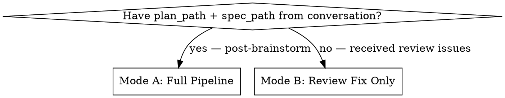

# Autonomous Feature Development

Fully autonomous development pipeline: parallel worktree implementation with TDD, verification, review, and fix loops. Also handles standalone post-review issue triage and fixing.

## Mode Selection

## Mode A: Full Pipeline

Read and execute each stage file in order:

| Stage | File | Description |
|-------|------|-------------|
| 0 + 1 | `./stage-impl.md` | Guard/setup, parallel worktree implementation |
| 2 | `./stage-verify.md` | Boot system, verify against spec acceptance criteria |
| 3 | `./stage-review-fix.md` | Spawn fresh reviewers, consolidate, fix |
| 4 | `./stage-final.md` | Lint, format, summary, final commit |

**FULLY AUTONOMOUS.** Never pause. Never ask. If ambiguous → reasonable assumption + code comment.

## Mode B: Standalone Review Fix

Issues already exist in conversation context. Read `./stage-review-fix.md` and follow the **Mode B path**: validate issues first, then fix validated ones.

## Hard Rules (both modes)

1. Never delete tests to make them pass.
2. Squash merge only — never plain `git merge` on worktree branches.
3. Always commit at the end, even partial (`wip:` prefix if any task failed).
4. All verifiable signals must be green before advancing to the next stage.
5. Ambiguous? → assume + comment, never stall.
