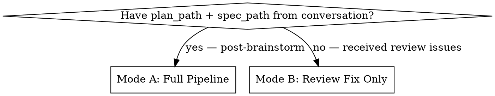

# Autonomous Feature Development

Fully autonomous development pipeline: parallel worktree implementation with TDD, verification, review, and fix loops. Also handles standalone post-review issue triage and fixing.

## Prerequisites (check before running)

This skill calls into other plugins that this one does not bundle. Before invoking
a dependency, confirm it is installed. If it is unavailable, **stop and tell the
user to install it** (see the plugin README) rather than failing silently:

- **`superpowers`** (required) — used for branch completion
  (`superpowers:finishing-a-development-branch`).
- **`ponytail`** (optional) — used as one of three parallel reviewers in Stage 3
  Mode A (`ponytail:ponytail-review`). If absent, skip that reviewer and proceed
  with the remaining two.
- **playwright MCP** (required for UI work) — used transitively by
  `verifying-implementation` during Stage 2. Bundled in this plugin's `.mcp.json`.

## Mode Selection

## Mode A: Full Pipeline

Read and execute each stage file in order:

| Stage | File                    | Description                                                                                                                                                                                                                                                                                        |
| ----- | ----------------------- | -------------------------------------------------------------------------------------------------------------------------------------------------------------------------------------------------------------------------------------------------------------------------------------------------- |
| 0 + 1 | `./stage-impl.md`       | Guard/setup, compute run `id`, parallel worktree implementation                                                                                                                                                                                                                                    |
| 2 + 3 | `./stage-review-fix.md` | **Capped verify↔review loop** (≤5 iterations): each iteration runs the VERIFY step in `./stage-verify.md`, then spawns fresh reviewers + consolidator, writes a code-review log, fixes actionable (blocking+important) issues, and re-verifies. Exits when a review raises zero actionable issues. |
| 4     | `./stage-final.md`      | Lint, format, summary, final commit                                                                                                                                                                                                                                                                |

**Run `id`:** computed once in Stage 0 (`stage-impl.md` Step 0.2); all logs live under
`.loop-logs/<id>/`. Mode B `id` = `<today>-review-<branch>`.

**FULLY AUTONOMOUS.** Never pause. Never ask. If ambiguous → reasonable assumption + code comment.

## Mode B: Standalone Review Fix

Issues already exist in conversation context. Read `./stage-review-fix.md`: the orchestrator validates the received issues and fixes them (Part 0), then enters the **same capped verify↔review loop** as Mode A until a review raises zero actionable issues.

## Hard Rules (both modes)

1. Never delete tests to make them pass.
2. Squash merge only — never plain `git merge` on worktree branches.
3. Always commit at the end, even partial (`wip:` prefix if any task failed).
4. All verifiable signals must be green before advancing to the next stage.
5. Ambiguous? → assume + comment, never stall.
6. The orchestrator never reads, writes, or executes product code or quality checks (lint/test/verify) or reviews — every such action is delegated to a single-responsibility subagent; the agent that implements a fix never reviews it. The orchestrator may do git plumbing and write the run's log/state files (e.g. `summary.md`, `code-review/round-<N>.md`, task JSON, `verification-state.json`, `error/*.md`).
