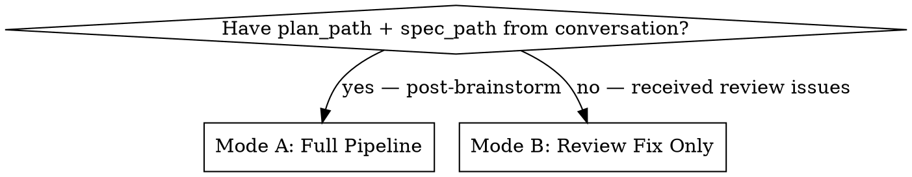

# Autonomous Feature Development

Fully autonomous development pipeline: parallel worktree implementation with TDD, verification, review, and fix loops. Also handles standalone post-review issue triage and fixing.

## Prerequisites (check before running)

This skill calls into other plugins that this one does not bundle. Before invoking
a dependency, confirm it is installed. If it is unavailable, **stop and tell the
user to install it** (see the plugin README) rather than failing silently:

- **`superpowers`** (required) — used for branch completion
  (`superpowers:finishing-a-development-branch`).
- **`ponytail`** (optional) — `ponytail:ponytail-review` is one of the skills the single Stage 5 review agent applies. If absent, skip that skill and proceed with the remaining ones.
- **Playwright CLI** — required for UI verification when `interaction_mode ==
  autonomous`. Nothing to install ahead of time: the Stage 2.5 preflight probe
  bootstraps a plugin-owned cache on first use (see
  `skills/verifying-implementation/playwright-cli-procedure.md`). When
  `human-in-loop`, it's optional: if unavailable, UI verification degrades to a human
  checklist handoff (see `stage-verify.md`).
- **`explain-changes`** (optional) — generates a reviewer-facing HTML report at
  the end of Stage 7 (`stage-final.md` Step 7.2b). If absent, or if it fails,
  skip it and proceed to commit/handoff — report generation never blocks the
  pipeline.

## Mode Selection

```dot
digraph mode {
    "Have plan_path + spec_path from conversation?" [shape=diamond];
    "Mode A: Full Pipeline" [shape=box];
    "Mode B: Review Fix Only" [shape=box];

    "Have plan_path + spec_path from conversation?" -> "Mode A: Full Pipeline" [label="yes — post-brainstorm"];
    "Have plan_path + spec_path from conversation?" -> "Mode B: Review Fix Only" [label="no — received review issues"];
}
```

## Interaction Mode

`interaction_mode` controls how the orchestrator handles missing capabilities and
human handoffs. It is distinct from the Mode A / Mode B pipeline selection above.

- `autonomous` (default) — assumed unless the invoking skill sets otherwise. Fail
  fast: a missing capability is a hard-stop error. Never pause, never ask.
- `human-in-loop` — set only by the `human-in-loop-feature-development` wrapper.
  Clarify with the human on a missing capability; pause and wait for input when
  human action is needed.

The orchestrator branches on `interaction_mode` at exactly four junctures:

1. **Stage 1 plan-gate ambiguity** — the elaboration subagent flags a decision it
   can't resolve alone. `autonomous`: best-guess, recorded in
   `<spec-basename>-assumptions.md`. `human-in-loop`: synchronous
   in-conversation clarification (no file-based pause — nothing state-bearing
   exists yet at Stage 1).
2. **Stage 2 preflight fallback** — an unresolved command or absent Playwright CLI capability.
3. **Stage 4 verify fallback** — the verifier reports `blocked` acceptance criteria
   (browser needed, Playwright CLI unavailable). `autonomous` hard-stops; `human-in-loop` writes a
   checklist, sets `last_outcome: "awaiting_human"`, and **pauses**. The Stage 4
   Clearance Gate in `stage-review-fix.md` blocks Stage 5 until the human clears it.
4. **Stage 7 commit** — auto-commit vs leave-unstaged handoff.

Everywhere else is identical across both values. **Subagents never branch on
`interaction_mode`** — they run to completion and cannot pause. They receive
concrete inputs (resolved commands, `playwright_available`) and keep assume-and-comment
behavior internally.

Two capped loops added by this design — Stage 3's faithfulness fix loop and
Stage 6's E2E fix loop, both capped at 2 rounds — do **not** add junctures.
They hard-stop uniformly regardless of `interaction_mode`, exactly like the
existing 3-attempt TDD exhaustion and 5-iteration review-loop exhaustion:
mode-branching here is reserved for missing capabilities, not for "attempted
and failed."

## Mode A: Full Pipeline

Read and execute each stage file in order:

| Stage | File                     | Description                                                                                                                                                                                                                                                                                        |
| ----- | ------------------------ | ---------------------------------------------------------------------------------------------------------------------------------------------------------------------------------------------------------------------------------------------------------------------------------------------------- |
| 1     | `./stage-plan-gate.md`   | Validate inputs, compute run `id`, gate-check `plan_path` for detail, classify/route non-implementation tasks, elaborate + review if needed |
| 2 + 3 | `./stage-impl.md`        | Guard/setup, then single-implementer sequential implementation with a faithfulness-verifier fix loop (≤2 rounds) |
| 4 + 5 | `./stage-review-fix.md`  | **Capped verify↔review loop** (≤5 iterations): each iteration runs the VERIFY step in `./stage-verify.md`, then spawns a single multi-skill review agent, writes a code-review log, fixes actionable (blocking+important) issues via a severity-gated pipeline, and re-verifies. Exits when a review raises zero actionable issues. |
| 6     | `./stage-e2e.md`         | E2E scenario planning + implementation with a faithfulness-verifier fix loop (≤2 rounds); skipped entirely if the project has no E2E tooling |
| 7     | `./stage-final.md`       | Lint, format, summary, final commit                                                                                                                                                                                                                                                                |

**Run `id`:** computed once in Stage 1 (`stage-plan-gate.md` Step 1.2); all logs live under
`.loop-logs/<id>/`. Mode B `id` = `<today>-review-<branch>`.

**When `interaction_mode == autonomous`: FULLY AUTONOMOUS** — never pause, never
ask; if ambiguous → reasonable assumption + code comment (or, in Stage 1, a
recorded assumption — see Interaction Mode above). When `human-in-loop`,
the orchestrator may pause at the four junctures above; subagents remain autonomous.

## Mode B: Standalone Review Fix

Issues already exist in conversation context. Read `./stage-review-fix.md`: the orchestrator validates the received issues and fixes them (Part 0), then enters the **same capped verify↔review loop** as Mode A until a review raises zero actionable issues.

## Hard Rules (both modes)

1. Never delete tests to make them pass.
2. Squash merge only — never plain `git merge` on worktree branches. See
   `../../rules/git-linear-history.md` for the full rule and rationale.
3. `interaction_mode == autonomous`: always commit at the end, even partial (`wip:`
   prefix if any task failed). `human-in-loop`: never auto-commit — leave changes
   unstaged on the branch for the human (see `stage-final.md`).
4. All verifiable signals must be green before advancing to the next stage.
5. Ambiguous? Subagents always assume + comment, never stall. The orchestrator does
   likewise when `interaction_mode == autonomous`; when `human-in-loop`, it clarifies
   at the three junctures instead.
6. The orchestrator never reads, writes, or executes product code or quality checks (lint/test/verify) or reviews — every such action is delegated to a single-responsibility subagent; the agent that implements a fix never reviews it. The orchestrator may do git plumbing and write the run's log/state files (e.g. `summary.md`, `code-review/round-<N>.md`, task JSON, `verification-state.json`, `error/*.md`).
